	 
	<a href="https://github.com/tool3/tool3/blame/main/tal.svg">
		<picture>
		  <source media="(min-width: 720px)" srcset="tal.svg">
		  
		</picture>
	</a>
	 

## [chartscii](https://github.com/tool3/chartscii)

## [shaders](https://github.com/tool3/shaders)

## [polyclock](https://github.com/tool3/polyclock)

## [contributions](https://github.com/tool3/contributions)

## [matcaps](https://github.com/tool3/matcaps)

## [cubed](https://github.com/tool3/cubed)

